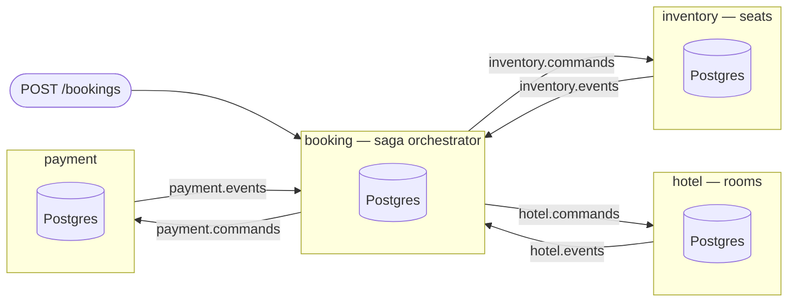

# SagaFlow

A distributed booking system — flight seat, hotel room, payment — built to
demonstrate how to keep four independent services consistent without a
distributed transaction.

It is a teaching artifact. There is no product here; the design *is* the
product. Everything is built as it would be in production, and the reason
anything exists is that it makes a specific failure impossible.

**What it demonstrates**

- **Event sourcing** with optimistic concurrency, where the choice of what
  counts as a stream is what makes a race condition impossible
- **The transactional outbox**, so a state change and the message announcing it
  commit together
- **Inbox deduplication**, turning Kafka's at-least-once delivery into
  apply-exactly-once
- **CloudEvents over Kafka** with a schema registry, Confluent framing, and
  compatibility enforced before anything reaches the wire
- **An orchestrated saga** with a compensation matrix and a pivot step, so a
  failure at any point leaves the system in a consistent state

New here? Start with the [reading order](#reading-order). Unfamiliar term? It is
in the [glossary](docs/glossary.md).

---

## The system at a glance



*This is the target architecture, not what is built today: only `inventory`
is a working service, `booking` has its database migrations and nothing
else, and `hotel` and `payment` do not exist yet. See [Status](#status).*

Four services, **four separate Postgres databases** — the separation is the
point, since one shared database would make the whole problem disappear along
with the lesson. Every database holds that service's events, its outbox and its
inbox. Nothing is shared but Kafka.

Each service owns a pair of topics: commands in, events out. Messages are keyed
by the target stream id, which gives per-stream ordering — the only ordering
guarantee anything relies on.

---

## Status

Built strictly in order, each phase ending somewhere demonstrable. Phases are
from design spec §13.

| Phase | What it is | Where | Status |
|---|---|---|---|
| 1 | Foundations — Compose, migrations, container-backed test support | `internal/platform/pg`, `internal/testsupport` | **built** |
| 2 | Event store — append/load with optimistic concurrency | `internal/platform/eventstore` | **built** |
| 3 | Contracts — protobuf, CloudEvents, schema registry framing | `contracts/`, `internal/platform/{envelope,codec,schema}` | **built** |
| 4 | Outbox and inbox — claim-based poller, consume-once dedup | `internal/platform/{outbox,inbox,kafka}` | **built** |
| 5a | Inventory — seat streams and holds | `internal/inventory` | **built** |
| 5b | Seat-hold TTL timer and availability projection | — | not built |
| 6 | Hotel and payment, with the provider stub and idempotency keys | — | not built |
| 7 | The saga — `Decide`, step timeouts, the compensation matrix | — | not built |
| 8 | Booking API and its projection | — | not built |
| 9 | Observability — OTel, including outbox trace continuation | — | not built |
| 10 | End-to-end tests — happy path, every compensation path, crash recovery | — | not built |

The reliability machinery is finished and proven: an event crosses from one
service's transaction to another service's handler, exactly once applied, and
survives a consumer rebalance. What is not yet built is most of the business
flow — there is no saga and no HTTP entry point yet.

---

## Reading order

Each step is self-contained. `go doc` renders the package chapters in the
terminal; there is nothing to install and nothing to run.

1. **This page**, then the [glossary](docs/glossary.md) — the vocabulary. Skim
   it; you will come back.
2. **[The architecture](docs/architecture.md)** — the whole picture, with
   diagrams: the topology, the delivery path that makes crashes survivable, the
   saga, and the compensation matrix.
3. **`go doc ./internal/platform/eventstore`** — how state is stored, and why
   the choice of stream boundary is the whole design. Then `eventstore.go`.
4. **`go doc ./internal/platform/outbox`** — how a state change becomes a
   message without a distributed transaction. Then `outbox.go`, then
   `poller.go`.
5. **`go doc ./internal/platform/inbox`** — how a message that arrives twice is
   applied once.
6. **[The message lifecycle](docs/message-lifecycle.md)** — the three above
   traced end to end with the actual rows, headers and bytes.
7. **`go doc ./internal/platform/envelope`**, then `codec`, then `schema` — what
   is actually on the wire and in the database, and why one schema has two
   encodings.
8. **`go doc ./internal/platform/kafka`** — the broker plumbing: which of
   Kafka's throughput-oriented defaults quietly lose work, and the three
   non-default options that are the difference between at-least-once and
   silent loss.
9. **`go doc ./internal/inventory`**, then `seat.go` — a real service. The
   decision functions are pure: no database, no context, and deliberately no
   clock.
10. **`internal/inventory/commands.go`** — the single transaction that ties
    every piece above together. Read it last; it will make sense only after the
    rest.

---

## Concepts and where they live

| Concept | Package | Chapter |
|---|---|---|
| Event sourcing, optimistic concurrency | [internal/platform/eventstore](internal/platform/eventstore) | `go doc ./internal/platform/eventstore` |
| Transactional outbox | [internal/platform/outbox](internal/platform/outbox) | `go doc ./internal/platform/outbox` |
| Inbox, consume-once | [internal/platform/inbox](internal/platform/inbox) | `go doc ./internal/platform/inbox` |
| Kafka produce, consume, DLQ | [internal/platform/kafka](internal/platform/kafka) | `go doc ./internal/platform/kafka` |
| CloudEvents envelope | [internal/platform/envelope](internal/platform/envelope) | `go doc ./internal/platform/envelope` |
| Protobuf in Postgres | [internal/platform/codec](internal/platform/codec) | `go doc ./internal/platform/codec` |
| Schema registry, Confluent framing | [internal/platform/schema](internal/platform/schema) | `go doc ./internal/platform/schema` |
| Connection pool, migrations | [internal/platform/pg](internal/platform/pg) | `go doc ./internal/platform/pg` |
| Seat streams and holds | [internal/inventory](internal/inventory) | `go doc ./internal/inventory` |
| Message contracts | [contracts/](contracts) | its own Go module |

Every package listed above has a chapter. The standard they are written to is in
[conventions](docs/conventions.md), and it is enforced rather than trusted:
`internal/docs/docs_test.go` fails the build if a package skips its chapter, drops
a heading, or cites a spec section from anywhere but a chapter's closing
section.

---

## Repository map

```
README.md                  you are here
contracts/                 the message schemas. its own Go module, so a
                           consumer can depend on it without depending on
                           any service's internals
proto/                     the .proto sources those are generated from.
                           one message per file — a Confluent framing
                           constraint, not a style choice
cmd/                       executables. today: schemactl, which registers
                           schemas
internal/
  platform/                the reusable machinery. one concept per package,
                           and no package here knows about any service
  inventory/               a service: seat streams, holds
  booking/                 a service: migrations only so far
  testsupport/             container fixtures for tests
  integration/             tests that need more than one service
  toolchain/               a test that fails if the Go version floor slips
  docs/                    a test that fails if a package skips its chapter
docs/
  conventions.md           how code and docs are written here
  glossary.md              every domain term, defined once
  superpowers/specs/       the design decisions and why they were made
  superpowers/plans/       how each phase was built, step by step
```

---

## Running it

Requires Docker and Go 1.26.6.

```bash
make up               # Kafka, four Postgres, Apicurio registry, Jaeger
make test             # unit tests only — never starts a container
make test-integration # everything, with real Kafka and Postgres
make lint             # gofmt, go vet, both modules, plus buf lint
make generate         # regenerate contracts from proto/
make breaking         # check proto changes against main
make schemas-register # register schemas; services never auto-register
make down
```

There is **no service to run yet** — no `main` for `inventory`, `booking`,
`hotel` or `payment`, and no HTTP entry point. The system is exercised through
its tests, which start real Kafka and Postgres containers. That changes in
phase 5b.

---

## Design decisions

The [design spec](docs/superpowers/specs/2026-08-17-sagaflow-design.md) is the
authority: what was decided, what was rejected, and why. You should not need it
to read the code — if a package leaves you with a question its chapter should
have answered, that is a bug in the chapter.

The [conventions](docs/conventions.md) describe how code and documentation are
written here, and are worth reading before changing anything.
