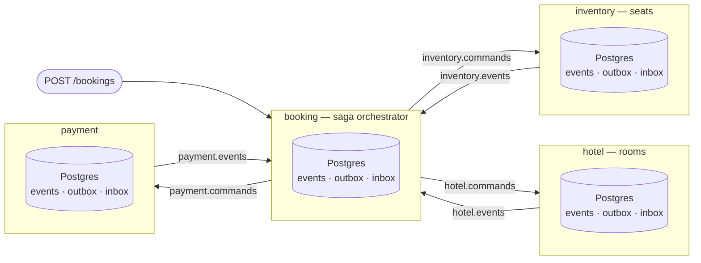
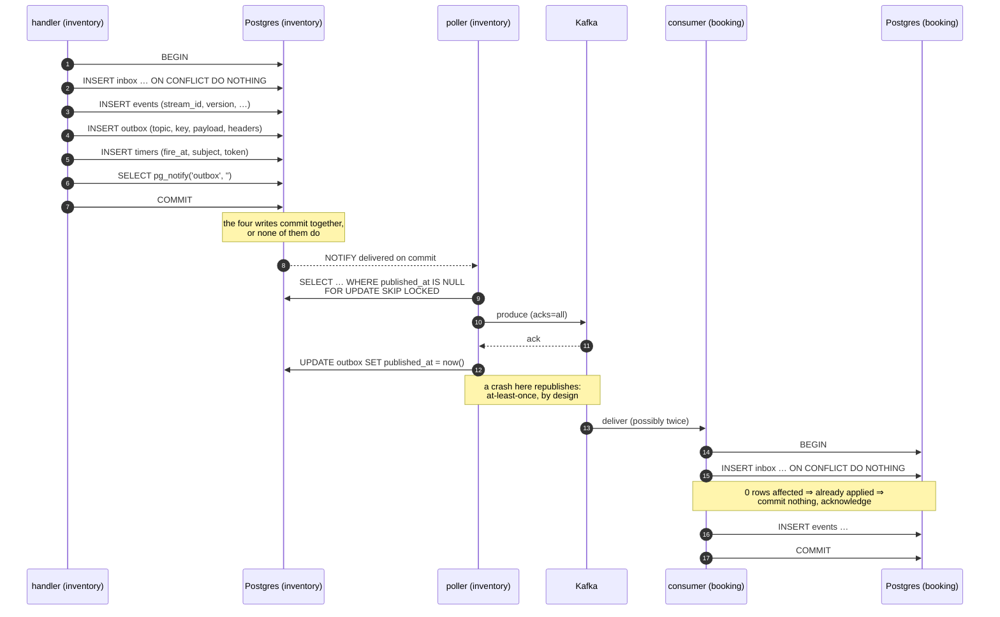
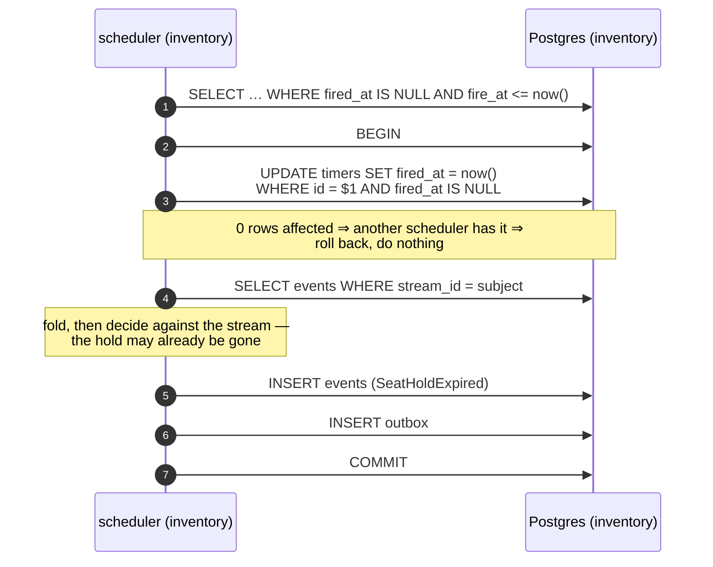
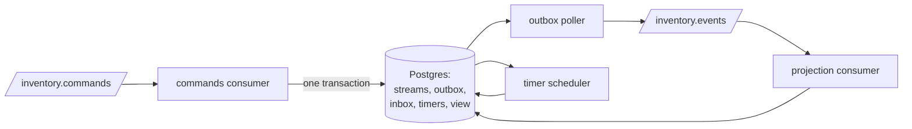
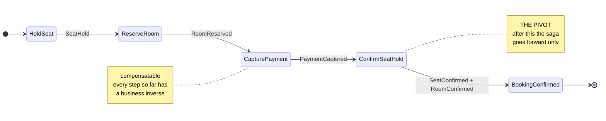
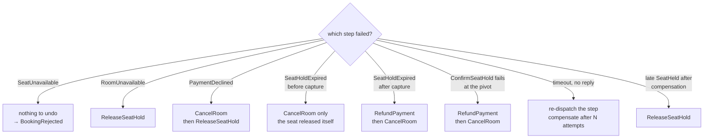

# Architecture

Four services take part in one booking: a flight seat, a hotel room, a payment.
They have **four separate databases** and no way to share a transaction. That is
the entire problem, and it is deliberate — one shared database would make the
problem disappear along with the lesson.

Everything here follows from a single constraint:

> A service can commit to its own database atomically. It cannot commit to its
> database and to Kafka atomically, and it cannot commit to another service's
> database at all.

Consistency is therefore not enforced. It is *arranged*, by making every
crossing point recoverable: a change and the message announcing it commit
together, a message that arrives twice is applied once, and a business step that
cannot be undone is never taken until everything that can be undone has
succeeded.

New here? Read the [README](../README.md) first, and keep the
[glossary](glossary.md) open.

---

## Topology



*Today only `inventory` is a working service. `booking` has its database
migrations and nothing else; `hotel` and `payment` do not exist. See the
[README's status table](../README.md#status).*

Each service owns a pair of topics — commands in, events out — and nothing else
reads its database.

| Topic | Produced by | Key | Consumed by |
|---|---|---|---|
| `inventory.commands` | `booking` | seat stream id | `inventory` |
| `inventory.events` | `inventory` | seat stream id | saga, projections |
| `hotel.commands` / `.events` | saga / `hotel` | room stream id | `hotel` / saga, projections |
| `payment.commands` / `.events` | saga / `payment` | payment stream id | `payment` / saga, projections |
| `booking.events` | `booking` | booking stream id | projections |
| `*.dlq` | any | original key | replay tooling |

**The key is always the target stream id.** That gives per-stream ordering, and
per-stream ordering is the only ordering guarantee anything in this system
relies on. Two events about the same seat arrive in order; two events about
different seats have no defined order and nothing may assume one.

Consumer groups are named per *purpose*, not per service — `booking.saga`,
`booking.projection`, `inventory.commands` — because one service consumes the
same topic more than once for different reasons. That is why the consumer name
is part of the inbox primary key.

Every service's database holds the same four tables plus its own domain
projections:

| Table | Holds |
|---|---|
| `events` | the append-only log. `UNIQUE (stream_id, version)` |
| `outbox` | messages waiting to be published, written in the transaction that produced them |
| `inbox` | which messages this service has already applied |
| `timers` | deadlines to come back at, written in the transaction that made them necessary |

---

## The delivery path

This is the sequence that makes "the state changed" and "the world was told"
survive a crash at any point. It is the heart of the system.



Three things about this diagram are worth stating plainly.

**The `NOTIFY` is transactional.** Postgres delivers it on commit and discards it
on rollback, so a woken poller can never chase a row that was never written.
This is why the wake-up needs no separate reliability story of its own.

**The gap between produce and mark is not closable.** The poller can publish a
row and die before recording that it did, and will publish it again on restart.
Every design that removes this window puts a worse one somewhere else —
mark-then-publish loses messages outright. So the duplicate is accepted, and
corrected at the consumer.

**The correction is the inbox insert, and it is inside the consumer's
transaction.** If the insert reports zero rows affected, this message has been
applied before: the handler commits nothing and acknowledges. Because the mark
and the effects share one transaction, they cannot come apart — which is what
turns at-least-once delivery into applied-exactly-once.

Where the code lives: `internal/platform/outbox` (enqueue and poller),
`internal/platform/inbox` (deduplication), `internal/platform/kafka` (produce
and consume), `internal/platform/eventstore` (the log). Each has its own chapter
— run `go doc ./internal/platform/outbox` and so on.

---

## The path with no message on it

A service runs a second background loop beside its outbox poller, and it exists
for the messages that never arrive.

A seat held by a booking that then crashes has no release coming. Nothing failed
and nothing is retrying — a message was simply never sent — so no amount of
redelivery machinery helps. The seat has to free itself.



Compare it with the delivery path above. Two differences carry the whole idea.

**There is no inbox row.** Nothing was delivered, so there is nothing to
deduplicate. The claim on the timer row does the job the inbox does elsewhere,
and it is in the same transaction as the effect for exactly the same reason.

**There is no leader election**, though the outbox poller has one. The outbox
elects because its effect — the Kafka publish — happens outside the row's
transaction, so two pollers on one row publish it twice. A timer's whole effect
is inside the transaction that claims it, so two schedulers racing one row settle
it between themselves.

The fire is decided against the stream, never against the clock, which is why a
deadline that arrives after the hold was already released does nothing at all
rather than freeing a seat someone else now holds. That is also why nothing here
ever cancels a timer.

Where the code lives: `internal/platform/timers` (the table and the loop),
`internal/inventory` (`expiry.go`, the decision about what a due timer means).

---

## The answer that is allowed to be wrong

Everything above is about being exactly right: one hold per seat, one apply per
message, no state change without the message that announces it. The read side is
the opposite. A customer opening a seat map wants three hundred seats at once,
and folding three hundred streams to draw one picture would make browsing the
most expensive thing the system does.

So there is a derived table, `seat_availability`, holding one row per seat that
has a stream. It is written by consuming `inventory.events`, and it lags by
however long that takes.

```mermaid
sequenceDiagram
    participant C as customer
    participant V as seat_availability
    participant S as seat stream
    C->>V: which seats are taken?
    V-->>C: 14A is free
    Note over S: 14A was held 40 ms ago;<br/>the view has not heard yet
    C->>S: hold 14A
    S-->>C: SeatUnavailable
```

The stale answer costs one click. It cannot cost a seat, because no decision is
ever taken from the view: a hold is decided from the seat's own stream, inside
the transaction that appends to it, where `UNIQUE(stream_id, version)` is
waiting. Cheap stale reads with strict writes is the standard split, and this is
what makes it safe here.

The projector does not apply the event it was handed. It re-reads the seat whose
stream changed and writes the fold — so the same notification twice produces the
same row, and two notifications in the wrong order both end at the current
state. That is why this consumer keeps no inbox row: there is no duplicate for
one to absorb. The same function run for every stream is a full rebuild, which
is how the view can be dropped whenever its shape needs to change.

## What a service is made of

A service here is not a request handler. Nothing calls it; it consumes, and it
runs four loops around one database — the shape every service in this system
takes, and today only `inventory` has all four.



Two of those loops exist because a message must not depend on anyone being
around to send it. The **outbox poller** publishes rows that some earlier
transaction committed, so a service that died between committing and publishing
publishes on its next start rather than losing the message. The **timer
scheduler** fires deadlines nobody is waiting on, which is the only reason a
seat held by a crashed booking ever comes back.

The other two are the two directions of the same topic pair: the **commands
consumer** applies what other services ask for, and the **projection consumer**
reads this service's own events back to keep the stale view moving.

`inventory.New` builds all of it and fails there if it can — an unreachable
database, an unregistered schema, a broker that is not up. `Run` starts the four
and returns when the context is cancelled or one of them fails. Cancelling is
the entire shutdown story, which is what makes "the service died in the middle
of a saga" a `cancel()` call in a test: the next process finds exactly what a
crash leaves behind, which is whatever committed and nothing else.

## The saga

*Not built. This section describes the design from the spec; phase 7 implements
it. Nothing in `internal/` corresponds to it yet.*

A booking is a business transaction spanning services that cannot share a
database transaction. SagaFlow **orchestrates** it: one service, `booking`,
holds the sequence and dispatches each step, rather than each service reacting
to the previous one's events. The orchestrator is itself event-sourced on a
`saga-{id}` stream, so crash recovery is replay and nothing else.



`HoldSeat`, `ReserveRoom` and `CapturePayment` are **compensatable** — each has
a business inverse. `ConfirmSeatHold` is the **pivot**: once a hold becomes a
confirmed seat there is no inverse, so everything after it is **retriable** and
must eventually succeed.

The saga's own decision function is pure — no database, no Kafka, no context:

```go
func (s SagaState) Decide(e Event) []Command
```

That is what makes every path through the compensation matrix testable without
infrastructure.

---

## Compensation

*Not built. Phase 7 implements the matrix; phase 10 tests every path through
it.*

When a step fails, the completed steps are undone in reverse order.



Three properties follow, and they are the substance of the design.

**Compensation is not rollback.** A refund is a new fact, recorded forever, not
an erasure of the payment. Cancelling a *confirmed* booking looks identical from
the outside — refund, cancel room, release seat — but is a separate business
flow with its own saga and its own policy, because "this transaction failed" and
"the customer changed their mind" need different audit trails.

**Compensations never dead-letter.** A failed `RefundPayment` means real money is
stranded and real inventory is held. It retries with backoff indefinitely and
raises an alert. The dead-letter policy applies to forward steps only.

**Late replies are absorbed, not errors.** A `SeatHeld` arriving after the saga
has already compensated finds a state where that step was abandoned, so the
decision function returns `ReleaseSeatHold` instead of proceeding.

---

## Where to go next

- [The message lifecycle](message-lifecycle.md) — this delivery path traced
  concretely, with the actual rows, headers and bytes.
- `go doc ./internal/platform/eventstore` — how state is stored.
- The [design spec](superpowers/specs/2026-08-17-sagaflow-design.md) — every
  decision, including the ones that were rejected and why.
