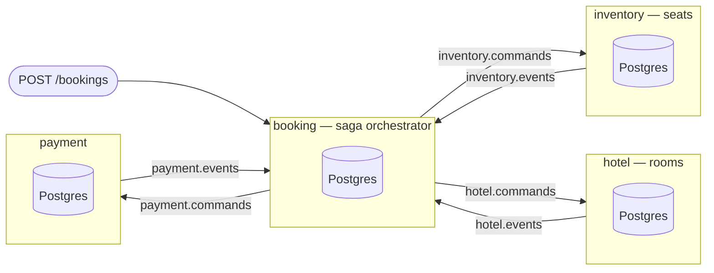

# Legibility L1 — Conventions, Glossary and the README Syllabus

> **For agentic workers:** REQUIRED SUB-SKILL: Use superpowers:subagent-driven-development (recommended) or superpowers:executing-plans to implement this plan task-by-task. Steps use checkbox (`- [ ]`) syntax for tracking.

**Goal:** Give the repository an entry point and a written standard, so that a
reader who has never seen it knows what it is and where to start, and every
later plan has one authority to follow.

**Architecture:** Three prose documents, no code. `docs/conventions.md` states
the standard that L2–L6 apply and that phases 5b–10 inherit. `docs/glossary.md`
defines every domain term once, so no chapter has to redefine "stream" or
"pivot". `README.md` is the syllabus: what SagaFlow is, what is built, one
topology diagram, and a reading order. None of the three explains a concept in
depth — that is what the per-package chapters in L3–L5 are for.

**Tech Stack:** Markdown. Mermaid for the diagram (GitHub renders it natively;
no toolchain, no generated image to fall stale). No Go changes.

**Spec:** [docs/superpowers/specs/2026-08-18-legibility-design.md](../specs/2026-08-18-legibility-design.md),
which amends [docs/superpowers/specs/2026-08-17-sagaflow-design.md](../specs/2026-08-17-sagaflow-design.md).
Where this plan and either spec disagree, the spec wins and the plan is wrong.

---

## Global Constraints

- **The reader is fixed** (legibility spec §2): *a competent Go programmer who
  has never seen this repository, does not know what a transactional outbox is,
  and has not read the design spec.* Do not explain what a database transaction
  or a goroutine is. Do explain every term specific to this system or this class
  of system.
- **Nothing is explained in two places** (legibility spec §5). Where a second
  document needs a concept, it links. A rule stated in `docs/conventions.md` is
  not restated in the README.
- **The four surfaces and their routing rule** (legibility spec §5): README =
  syllabus, status, structure, reading order, no explanations. `docs/` =
  cross-cutting only. `doc.go` = one concept's chapter. Declaration comments =
  self-contained, no citations.
- **Honesty about status** (legibility spec §12): H1 — the README carries a
  build-status table covering every phase of design spec §13. H2 — any document
  describing unbuilt behavior says so at the point of description.
- **No code changes in this plan.** No `.go` file is created or modified. The
  Go suite must be untouched, and is run only to prove that.
- **Module path is `github.com/AymanKastali/sagaflow`.** The contracts module is
  `github.com/AymanKastali/sagaflow/contracts`.
- **Every relative link must resolve.** A link to a file that does not exist yet
  is a defect; say the document is not yet written in plain text instead.
- **Markdown fences inside this plan** use four backticks, because the documents
  being written contain three-backtick fences of their own.

---

## Scope

| In this plan | |
|---|---|
| `docs/conventions.md` | The chapter, comment and naming standard — legibility spec §6, §7, §8 |
| `docs/glossary.md` | Every domain term, defined once — legibility spec SC6 |
| `README.md` | Syllabus, status table, topology diagram, reading order — legibility spec §12, SC3 |

| Deferred | Where |
|---|---|
| `docs/architecture.md`, the four diagrams, `docs/message-lifecycle.md` | L2 |
| Per-package `doc.go` chapters and the comment/naming rewrite | L3 (storage core), L4 (wire), L5 (service) |
| `internal/docs/docs_test.go` enforcement | L6 — written earlier it would fail for every package not yet converted and hold the suite red across five plans |
| A runnable demo of the saga | Deferred past phase 10 (legibility spec §16) |

**L2 will edit `README.md`** to turn this plan's two "not yet written" markers
into links, once `docs/architecture.md` and `docs/message-lifecycle.md` exist.
That is expected, not a defect in this plan.

---

## File structure

Three new files, all at paths a reader would guess:

```
README.md              ← the entry point. the first thing anyone opens.
docs/
├── conventions.md     ← the standard. read by contributors, not by learners.
├── glossary.md        ← the vocabulary. read once, referred to forever.
└── superpowers/       ← unchanged
```

Responsibilities are disjoint: `conventions.md` says *how to write*,
`glossary.md` says *what words mean*, `README.md` says *what this is and where
to start*. No document contains an explanation of a mechanism — mechanisms are
explained in `doc.go` chapters (L3–L5) and in `docs/architecture.md` (L2).

---

## Task 1: The conventions document

**Files:**
- Create: `docs/conventions.md`

**Interfaces:**
- Consumes: nothing.
- Produces: the rule identifiers `C1`–`C7` (chapter), `R1`–`R5` (comments),
  `N1`–`N3` (naming), `D1`–`D5` (enforcement). Tasks 2 and 3 of this plan, and
  every task of L2–L6, cite these identifiers. The identifiers are copied from
  the legibility spec and must not be renumbered.

- [ ] **Step 1: Write `docs/conventions.md`**

````markdown
# Conventions

How code and documentation are written in this repository.

These rules exist because SagaFlow's product is the system design it
demonstrates. Code that is correct but unreadable has not delivered that
product. The reasoning behind each rule is in the
[legibility design spec](superpowers/specs/2026-08-18-legibility-design.md);
this page is the operative version, for someone about to write something.

**The reader every rule is written for:**

> A competent Go programmer who has never seen this repository, does not know
> what a transactional outbox is, and has not read the design spec.

Do not explain what a transaction, a goroutine or a foreign key is. Do explain
every term specific to this system or to this class of system — or link it to
the [glossary](glossary.md).

---

## Where things are written

Documentation lives in exactly four places, and the boundaries are rules rather
than preferences. Duplicated explanation is what goes stale, so nothing is
explained twice; a second place that needs the concept links to the first.

| Surface | Holds | Does not hold |
|---|---|---|
| `README.md` | What this is, what is built, one diagram, the reading order | Any explanation of any mechanism |
| `docs/*.md` | Anything true of more than one package: the lifecycle, the topology, the compensation matrix, the diagrams, this page, the glossary | Anything about a single package |
| `<pkg>/doc.go` | One concept's chapter | Anything spanning packages |
| Declaration comments | What this identifier is, then why it is this way | Citations, deferrals, references to a document |

**Routing:** concerns one package → `doc.go`. Spans packages → `docs/`. Is a
concrete trace → an executable `Example` or an annotated test, linked from the
prose that describes it. Names status, structure or reading order → `README.md`.

---

## The chapter standard

Every package under `internal/` and `contracts/` has a `doc.go` containing the
package comment and nothing else — no code, no imports. It uses these six
headings, in this order, in Go's godoc heading syntax so that `go doc` renders
them:

```go
// Package outbox makes "the state changed" and "the message was sent" the
// same commit.
//
// # The problem
//
// # Why the obvious fixes do not work
//
// # What this package does
//
// # What it deliberately does not do
//
// # Reading order
//
// # Where this comes from
package outbox
```

- **C1.** The first sentence is a complete definition of the concept in plain
  language, true out of context — it is what `go doc` lists.
- **C2.** *The problem* describes the failure a reader would hit **without** this
  package. Concrete, not abstract: name what ends up wrong.
- **C3.** *Why the obvious fixes do not work* is mandatory, and is the most
  valuable section on the page. A reader who has not been shown why the simple
  thing fails has learned nothing from being shown the complex thing.
- **C4.** *What it deliberately does not do* names the boundary and points at
  whatever handles the rest. This is how a reader builds a map instead of a pile.
- **C5.** *Reading order* lists the package's own files, one clause each, and
  names where to start.
- **C6.** *Where this comes from* carries the design-spec citations. **This is
  the only place in Go source where `§` may appear.**
- **C7.** 60–120 lines. Shorter means the concept was not explained; longer means
  it belongs in `docs/`.

---

## The comment standard

- **R1 — No citations outside `doc.go`.** A comment may not defer its
  explanation to a document. If a decision needs justifying, justify it here.
- **R2 — What before why.** A declaration comment's first sentence says what the
  identifier is or does. Justification follows. A comment that opens with a
  rationale is addressed to a reviewer, not to a reader.
- **R3 — Define on first use.** The first time a package's own code uses a
  domain term, define it: in `doc.go` if the package is about it, inline if it
  is borrowed. Terms owned elsewhere link to the [glossary](glossary.md).
- **R4 — One line inside a body.** Comments inside a function body are single
  lines marking a non-obvious step. Anything longer belongs on the declaration.
- **R5 — Functions stay under about 40 lines.**

### What this looks like

Before — fails R1 (cites a section), R2 (opens with a rationale for a rule the
reader has not been told), and R3 (uses *stream*, *outbox row*, *inbox row* and
*conflict* undefined):

```go
// handleOnce is spec §7.2's invariant: one transaction writes exactly one
// stream, plus its outbox rows, plus its inbox row.
//
// The inbox mark is inside the transaction so a conflict rolls it back too —
// otherwise the retry would find its own mark and treat the command as already
// handled.
```

After — self-contained, what before why, no citation:

```go
// applyInOneTransaction handles a single command in a single database
// transaction, which either commits all of its effects or none of them.
//
// Three things are written together and must not come apart: the events the
// command produced, the outgoing messages announcing them, and the record that
// this command was consumed. If the events committed but the messages did not,
// the world would never hear about a hold that exists. If the consumed-record
// committed but the events did not, redelivery would be ignored and the command
// would be lost.
```

---

## The naming standard

- **N1 — Domain terms are never abbreviated.** `envelope`, `outbox`, `command`,
  `correlation`. The single exception is `cmd`, retained because it is
  unambiguous here and appears in a hundred places.
- **N2 — Short names need short lives.** A one- or two-letter name is allowed
  only when the variable's whole life is within about three lines. `ctx`, `tx`,
  `err`, `t *testing.T`, `i`, and `b` in a two-line byte helper are conventional
  and stay.
- **N3 — A name that reads as something else gets replaced,** even when it is
  technically correct.

| Instead of | Write | Because |
|---|---|---|
| `env envelope.Envelope` | `incoming envelope.Envelope` | `env` reads as "environment" |
| `out Outcome` | `decision Outcome` | `out` reads as an output parameter |
| `fresh bool` | `firstDelivery bool` | "fresh" does not say fresh *what* |
| `handleOnce` | `applyInOneTransaction` | the name hid the entire point |

---

## Worked examples are executable

A worked example written in a comment can quietly stop being true. Worked
examples are therefore Go [`Example` functions](https://go.dev/blog/examples),
which are compiled and run by `go test` and whose printed output is checked. An
example that stops being true fails `make test`.

Use them wherever a function is pure enough to run without infrastructure.

---

## Testing conventions

Inherited from design spec §12, restated here because they are part of the
standard:

- **`make test` never starts a container.** Integration tests call
  `testing.Short()` and skip. `make test-integration` runs everything.
- **One container per package, started in `TestMain`.** `pgtest`, `kafkatest`
  and `srtest` each expose `Start()` for `TestMain` and `Shared(t)` for tests.
  None can start a container for a single test. Isolation comes from database
  names, topic names and consumer groups derived from the test.
- **No `time.Sleep` in assertions.** Tests wait on a signal — a channel, a
  terminal event — with a context deadline as the failure mode.

---

## Enforcement

`internal/docs/docs_test.go` checks the mechanical parts, so the standard
survives without anyone remembering to care. It walks the tree: a package added
later that skips its chapter fails the suite the day it is written.

- **D1.** Every package under `internal/` and `contracts/` has a non-empty
  package comment.
- **D2.** That comment is in a file named `doc.go` containing only the package
  comment.
- **D3.** Each `doc.go` contains all six chapter headings, in order.
- **D4.** No `.go` file other than a `doc.go` contains `§`.
- **D5.** `README.md` links to every package directory under
  `internal/platform/`.

D3 checks headings, not quality — no test can judge whether an explanation is
good. The headings are chosen so that filling them in dishonestly is more work
than filling them in honestly.
````

- [ ] **Step 2: Verify every link in the document resolves**

Run from the repository root:

```bash
grep -oP '\]\(\K[^)#]+' docs/conventions.md \
  | grep -v '^http' \
  | while read -r target; do
      [ -e "docs/$target" ] || echo "BROKEN: $target"
    done; echo "link check done"
```

Expected: `BROKEN: glossary.md` (twice — it is written in Task 2) and
`link check done`. No other broken target. In particular
`superpowers/specs/2026-08-18-legibility-design.md` must **not** appear.

- [ ] **Step 3: Verify the rule identifiers match the spec exactly**

A renumbered rule silently breaks every citation in L2–L6.

```bash
for id in C1 C2 C3 C4 C5 C6 C7 R1 R2 R3 R4 R5 N1 N2 N3 D1 D2 D3 D4 D5; do
  # the spec writes C and D rules as **C1.** and R and N rules as **R1 — ,
  # so the pattern has to accept a period or a space after the identifier
  inspec=$(grep -c "\*\*$id[. ]" docs/superpowers/specs/2026-08-18-legibility-design.md)
  indoc=$(grep -c "\*\*$id[. ]" docs/conventions.md)
  [ "$inspec" -ge 1 ] && [ "$indoc" -ge 1 ] || echo "MISSING $id (spec=$inspec doc=$indoc)"
done; echo "identifier check done"
```

Expected: no `MISSING` lines, then `identifier check done`.

- [ ] **Step 4: Verify no Go file was touched**

```bash
git status --porcelain
```

Expected: exactly one line, `?? docs/conventions.md`.

- [ ] **Step 5: Commit**

```bash
git add docs/conventions.md
git commit -m "docs: write the code and documentation standard

Four documentation surfaces with a routing rule so nothing is explained
twice, the six-heading chapter standard, the comment standard whose central
rule is what-before-why, the naming standard, and the enforcement checks
L6 will implement.

The worked before/after is the real handleOnce from internal/inventory,
which currently fails three of the five comment rules at once.

Rule identifiers C1-C7, R1-R5, N1-N3, D1-D5 are copied from the legibility
spec and are cited by L2-L6 — they must not be renumbered.

Co-Authored-By: Claude Opus 5 (1M context) <noreply@anthropic.com>"
```

---

## Task 2: The glossary

**Files:**
- Create: `docs/glossary.md`

**Interfaces:**
- Consumes: `docs/conventions.md` from Task 1 (linked from the header).
- Produces: the anchor names every later document links to. Anchors are
  GitHub's slugification of the heading — `## Correlation id` becomes
  `#correlation-id`. L2–L6 link terms as `docs/glossary.md#stream`.

**Term selection rule:** a term belongs here if it is specific to this system or
to this class of system, and is used by more than one package. A term used by
exactly one package is defined in that package's `doc.go` instead (rule R3).

- [ ] **Step 1: Write `docs/glossary.md`**

````markdown
# Glossary

Every term this system uses that you would not already know. Defined once;
everything else links here.

A term used by only one package is defined in that package's `doc.go` instead —
see [conventions](conventions.md).

Entries marked **(not built yet)** describe parts of the design that exist in
the [design spec](superpowers/specs/2026-08-17-sagaflow-design.md) but not yet
in code. See the status table in the [README](../README.md).

---

## At-least-once delivery

A guarantee that a message will arrive, possibly more than once. It is what you
get from any system that retries on failure, because a sender that does not know
whether its message arrived can only choose between sending again (duplicates)
and giving up (loss).

SagaFlow chooses duplicates, everywhere. The correction happens at the receiver
— see [inbox](#inbox).

## Causation id

The `ce_id` of the message that directly caused this one. Distinct from a
[correlation id](#correlation-id): causation is the parent link, correlation is
the whole tree. Follow causation ids backwards and you get the exact chain that
produced a message; group by correlation id and you get everything belonging to
one business operation.

Carried as the `ce_causationid` header. See `internal/platform/envelope`.

## CloudEvents

A CNCF specification for describing an event's metadata in a transport-neutral
way — who emitted it, what type it is, what it is about — so that the same event
can cross Kafka, HTTP and anything else without its metadata being reinvented.

SagaFlow uses CloudEvents v1.0.2 in *binary content mode*, meaning the
attributes travel as Kafka headers (`ce_id`, `ce_source`, `ce_type`,
`ce_subject`, `ce_correlationid`, `ce_causationid`) and the message body is the
payload alone. See `internal/platform/envelope`.

## Command

A message asking for something to happen: `HoldSeat`, `ReleaseSeatHold`. It may
be refused. Commands are addressed to exactly one service, and travel on that
service's `*.commands` topic.

Contrast with an [event](#event), which reports something that already happened
and cannot be refused.

## Compensation

The business inverse of a completed step, run when a later step fails.
`ReleaseSeatHold` compensates `HoldSeat`; `RefundPayment` compensates
`CapturePayment`.

Compensation is **not rollback**. A refund is a new fact, recorded forever, not
an erasure of the payment. Compensations run in reverse order of completion, and
they never dead-letter: a failed refund means real money is stranded, so it
retries indefinitely and raises an alert.

## Compensatable step

A saga step that has a business inverse, and so can be undone if a later step
fails. `HoldSeat`, `ReserveRoom` and `CapturePayment` are compensatable.

Contrast with [retriable](#retriable-step), and see [pivot](#pivot).

## Confluent wire format

The framing Confluent's clients put around a message body so a consumer can
discover which schema to decode it with: one magic byte `0x00`, a four-byte
big-endian schema id, a protobuf message-index path, then the payload.

The message-index path names which message inside the `.proto` file this is.
Every `.proto` file in this repository holds exactly one message, so the path is
always `[0]`, which the format shortens to a single zero byte. That constraint
is load-bearing — a second message in a file would be framed under the wrong
index and be unreadable by other Confluent clients, while still round-tripping
through our own code. See `internal/platform/schema`.

## Consumer group

Kafka's unit of work-sharing: every partition of a topic is assigned to exactly
one member of a group, and each group tracks its own position independently.

SagaFlow's groups are **per purpose, not per service** — `booking.saga`,
`booking.projection`, `inventory.commands` — because one service may consume the
same topic twice for different reasons. That is why the consumer name is part of
the [inbox](#inbox) primary key.

## Correlation id

An identifier shared by every message belonging to one business operation. All
messages produced while booking one trip carry the same `ce_correlationid`,
whichever service produced them.

It is how a reply finds its way back to the saga that is waiting for it, and how
one booking's whole story is retrieved from logs or traces. Contrast with
[causation id](#causation-id).

## Dead-letter queue (DLQ)

A topic where messages that cannot be processed are parked, so that one bad
message does not block the partition behind it.

In SagaFlow the DLQ policy applies to **forward steps only**. Compensations
never dead-letter — see [compensation](#compensation).

## Envelope

The metadata around a message body: its id, type, source, subject, correlation
and causation ids. In SagaFlow the envelope is [CloudEvents](#cloudevents)
attributes carried as Kafka headers, and `internal/platform/envelope` is the
package that maps between them.

The body is protobuf and knows nothing about the envelope; the envelope is
transport metadata and knows nothing about the body. Keeping them separate is
what lets the same message be stored in Postgres and published to Kafka with two
different encodings of one schema.

## Event

A message reporting something that has already happened: `SeatHeld`,
`SeatHoldReleased`. Events are facts, are named in the past tense, and cannot be
refused or retracted — only followed by a further event.

Not every reply is an event. `SeatUnavailable` is a refusal, and nothing
happened to the seat, so it is a [reply](#reply) and is never appended to a
stream.

## Event sourcing

Storing state as the complete ordered sequence of events that produced it,
rather than as a row that is overwritten. Current state is computed by replaying
the events — see [fold](#fold).

The reason SagaFlow does it: the history *is* the audit trail, concurrency is
enforced by an append constraint rather than by locking, and a projection that
turns out to be wrong can be dropped and rebuilt from the events. See
`internal/platform/eventstore`.

## Exactly-once

Applied exactly once — never *delivered* exactly once. Kafka delivers
[at least once](#at-least-once-delivery); the receiver makes duplicate delivery
harmless by recording what it has already applied, inside the same transaction
as the effect. See [inbox](#inbox).

The distinction matters because "exactly-once delivery" is not achievable
across a network, and designs that assume it are wrong in ways that only show up
under failure.

## Fold

Replaying a stream's events in order to compute current state, each event
applied to the state the previous ones produced.

In SagaFlow folds are pure functions with no database, no clock and no context,
which is what makes them testable without infrastructure. See
`internal/inventory/seat.go`.

## Idempotency key

A caller-supplied identifier that lets a downstream system recognise a retry of
a request it has already performed, and return the original result instead of
performing it twice.

Used for the payment provider, where a duplicated capture is a duplicated
charge. **(not built yet — phase 6)**

## Inbox

A table recording every message a consumer has already applied, written inside
the same transaction as that message's effects, so that a redelivered message is
recognised and ignored.

This is what turns Kafka's [at-least-once delivery](#at-least-once-delivery)
into apply-[exactly-once](#exactly-once). It is the mirror image of the
[outbox](#outbox): the outbox makes sure the message is sent, the inbox makes
sure it is applied once. See `internal/platform/inbox`.

## Optimistic concurrency

Allowing concurrent writers to proceed without locking, and detecting the
collision at write time instead of preventing it.

In SagaFlow every event carries a version, and `UNIQUE(stream_id, version)`
means the second writer to reach version *n* simply fails. There is no lock, no
timeout and no deadlock — the loser reloads and decides again. See
[version conflict](#version-conflict).

## Outbox

A table into which outgoing messages are written **in the same transaction as
the state change they announce**, so that the change and the intent to publish
commit together or not at all. A separate poller publishes committed rows
afterwards.

It exists because a service cannot atomically update its database and a broker.
The cost is that a crash between publishing and marking republishes, which is
why the [inbox](#inbox) exists. See `internal/platform/outbox`.

## Pivot

The saga step after which there is no going back: everything before it is
[compensatable](#compensatable-step), everything after it is
[retriable](#retriable-step) and must eventually succeed.

In SagaFlow the pivot is `ConfirmSeatHold`. Once a hold becomes a confirmed
seat, the saga rolls forward only. **(not built yet — phase 7)**

## Poller

The loop that reads committed [outbox](#outbox) rows and publishes them,
separately from the transaction that wrote them. It wakes on a Postgres
`NOTIFY` sent by that transaction — transactional, so it is delivered on commit
and discarded on rollback, and a woken poller never chases a row that was never
written. See `internal/platform/outbox/poller.go`.

## Projection

A queryable view built by consuming events, kept separate from the events
themselves. Because it derives entirely from the stream it can be dropped and
rebuilt, which is what makes it safe to change its shape.

`bookings_view` and the seat availability view are projections.
**(not built yet — phases 5b and 8)**

## Reply

A message sent back to whoever issued a [command](#command), reporting the
outcome. Every command gets a reply; only a change gets an [event](#event).

The distinction is load-bearing. `SeatUnavailable` is a reply and not an event:
nothing happened to the seat, so appending it would grow the seat's history by
one row for every losing racer. Nothing may produce silence, because a saga step
that hears nothing re-dispatches forever.

## Retriable step

A saga step with no business inverse, which must therefore eventually succeed.
Everything after the [pivot](#pivot) is retriable.

## Saga

A long-running business transaction spread across services that cannot share a
database transaction, made consistent by compensating completed steps when a
later step fails.

SagaFlow uses an **orchestrated** saga: one service (`booking`) holds the
sequence and dispatches each step, rather than each service reacting to the
previous one's events. The orchestrator is itself event-sourced, so crash
recovery is replay. **(not built yet — phase 7)**

## Schema registry

A service holding the schema for each message type under a name called a
*subject*, so producers and consumers agree on the format and incompatible
changes are rejected before they reach the wire.

SagaFlow registers schemas explicitly through `make schemas-register` and never
auto-registers, so an unregistered subject is a startup failure rather than a
surprise at publish time. See `internal/platform/schema`.

## Stream

The unit of ordering and concurrency in the event store: an ordered sequence of
events sharing a `stream_id`, each with a version, unique together.

**Choosing what a stream is, is the central design decision here.** A seat is a
stream — `seat-BA117-2026-09-01-14A` — so "this seat is held at most once" is
enforced by `UNIQUE(stream_id, version)` and by nothing else: no lock, no
check-then-act, no race. A stream per flight would have serialised every seat in
the aircraft; a stream per booking would have made the constraint unable to see
the conflict at all.

## Subject

The name a schema is registered under. SagaFlow uses
*TopicRecordNameStrategy* — `<topic>-<fully.qualified.MessageName>`, for example
`inventory.events-sagaflow.inventory.v1.SeatHeld`.

The default strategy allows only one schema per topic; SagaFlow's topics carry
several message types, so it would break on the second one.

## Version conflict

The error returned when two writers try to append the same version to the same
[stream](#stream) and the unique constraint rejects the loser.

It is expected, not exceptional. The loser reloads the stream and decides again
against the state that actually exists — which is the point: replaying the old
decision would append a second hold, whereas re-deciding turns it into a
refusal. Three immediate retries, then the command fails.
````

- [ ] **Step 2: Verify every link resolves, including anchors**

Cross-references between glossary entries are the easiest thing to get wrong.

```bash
# file links
grep -oP '\]\(\K[^)#]+' docs/glossary.md | grep -v '^http' \
  | while read -r t; do [ -e "docs/$t" ] || echo "BROKEN FILE: $t"; done

# same-page anchors must match a heading's GitHub slug: lowercase, drop
# anything that is not a letter, digit, space or hyphen, spaces to hyphens
grep '^## ' docs/glossary.md | sed 's/^## //' \
  | tr 'A-Z' 'a-z' | sed 's/[^a-z0-9 -]//g; s/ /-/g' | sort -u > /tmp/slugs
grep -oP '\]\(#\K[^)]+' docs/glossary.md | sort -u \
  | while read -r a; do
      grep -qx "$a" /tmp/slugs || echo "BROKEN ANCHOR: #$a"
    done
rm -f /tmp/slugs
echo "link check done"
```

Expected: no `BROKEN` lines at all, then `link check done`. `conventions.md`,
`superpowers/specs/2026-08-17-sagaflow-design.md` and `../README.md` are the
file links; `../README.md` will report broken until Task 3 — that is the only
acceptable failure.

- [ ] **Step 3: Verify the unbuilt terms are marked**

Rule H2: a document describing unbuilt behavior says so at the point of
description.

```bash
for term in 'Idempotency key' 'Pivot' 'Projection' 'Saga'; do
  awk -v t="## $term" '$0==t{f=1;next} /^## /{f=0} f' docs/glossary.md \
    | grep -q 'not built yet' || echo "UNMARKED: $term"
done; echo "status marker check done"
```

Expected: no `UNMARKED` lines, then `status marker check done`.

- [ ] **Step 4: Commit**

```bash
git add docs/glossary.md
git commit -m "docs: define every domain term once

Thirty terms a reader would not already know, each defined once so that no
package chapter has to redefine 'stream' or 'pivot'. Terms used by a single
package stay in that package's doc.go instead, per rule R3.

The entries that carry the design's weight rather than just its vocabulary:
stream (why a seat is a stream and a flight is not), reply (why
SeatUnavailable is not an event), exactly-once (applied, never delivered),
and confluent wire format (why every .proto file holds exactly one message).

Terms whose implementation does not exist yet are marked at the point of
description, per rule H2.

Co-Authored-By: Claude Opus 5 (1M context) <noreply@anthropic.com>"
```

---

## Task 3: The README syllabus

**Files:**
- Create: `README.md`

**Interfaces:**
- Consumes: `docs/conventions.md` (Task 1) and `docs/glossary.md` (Task 2).
- Produces: the concept→package table that L3–L5 keep in step as they write
  each chapter, and the status table that phases 5b–10 update as they land.

**Constraint reminder:** the README contains **no explanation of any mechanism**
(routing rule, conventions §"Where things are written"). It says what the
system is, what is built, and where to read. Every "why" belongs in a chapter.

- [ ] **Step 1: Write `README.md`**

````markdown
# SagaFlow

A distributed booking system — flight seat, hotel room, payment — built to
demonstrate how to keep four independent services consistent without a
distributed transaction.

It is a teaching artifact. There is no product here; the design *is* the
product. Everything is built as it would be in production, and the reason
anything exists is that it makes a specific failure impossible.

**What it demonstrates**

- **Event sourcing** with optimistic concurrency, where the choice of what
  counts as a stream is what makes a race condition impossible
- **The transactional outbox**, so a state change and the message announcing it
  commit together
- **Inbox deduplication**, turning Kafka's at-least-once delivery into
  apply-exactly-once
- **CloudEvents over Kafka** with a schema registry, Confluent framing, and
  compatibility enforced before anything reaches the wire
- **An orchestrated saga** with a compensation matrix and a pivot step, so a
  failure at any point leaves the system in a consistent state

New here? Start with the [reading order](#reading-order). Unfamiliar term? It is
in the [glossary](docs/glossary.md).

---

## The system at a glance



Four services, **four separate Postgres databases** — the separation is the
point, since one shared database would make the whole problem disappear along
with the lesson. Every database holds that service's events, its outbox and its
inbox. Nothing is shared but Kafka.

Each service owns a pair of topics: commands in, events out. Messages are keyed
by the target stream id, which gives per-stream ordering — the only ordering
guarantee anything relies on.

---

## Status

Built strictly in order, each phase ending somewhere demonstrable. Phases are
from design spec §13.

| Phase | What it is | Where | Status |
|---|---|---|---|
| 1 | Foundations — Compose, migrations, container-backed test support | `internal/platform/pg`, `internal/testsupport` | **built** |
| 2 | Event store — append/load with optimistic concurrency | `internal/platform/eventstore` | **built** |
| 3 | Contracts — protobuf, CloudEvents, schema registry framing | `contracts/`, `internal/platform/{envelope,codec,schema}` | **built** |
| 4 | Outbox and inbox — claim-based poller, consume-once dedup | `internal/platform/{outbox,inbox,kafka}` | **built** |
| 5a | Inventory — seat streams and holds | `internal/inventory` | **built** |
| 5b | Seat-hold TTL timer and availability projection | — | not built |
| 6 | Hotel and payment, with the provider stub and idempotency keys | — | not built |
| 7 | The saga — `Decide`, step timeouts, the compensation matrix | — | not built |
| 8 | Booking API and its projection | — | not built |
| 9 | Observability — OTel, including outbox trace continuation | — | not built |
| 10 | End-to-end tests — happy path, every compensation path, crash recovery | — | not built |

The reliability machinery is finished and proven: an event crosses from one
service's transaction to another service's handler, exactly once applied, and
survives a consumer rebalance. What is not yet built is most of the business
flow — there is no saga and no HTTP entry point yet.

---

## Reading order

Each step is self-contained. `go doc` renders the package chapters in the
terminal; there is nothing to install and nothing to run.

1. **This page**, then the [glossary](docs/glossary.md) — the vocabulary. Skim
   it; you will come back.
2. **The architecture walkthrough** — the whole picture, with diagrams.
   *Not yet written; it arrives in the next documentation pass.*
3. **`go doc ./internal/platform/eventstore`** — how state is stored, and why
   the choice of stream boundary is the whole design. Then `eventstore.go`.
4. **`go doc ./internal/platform/outbox`** — how a state change becomes a
   message without a distributed transaction. Then `outbox.go`, then
   `poller.go`.
5. **`go doc ./internal/platform/inbox`** — how a message that arrives twice is
   applied once.
6. **The message lifecycle** — the three above traced end to end with the
   actual rows and headers. *Not yet written; it arrives in the next
   documentation pass.*
7. **`go doc ./internal/platform/envelope`**, then `codec`, then `schema` — what
   is actually on the wire and in the database, and why one schema has two
   encodings.
8. **`go doc ./internal/platform/kafka`** — the broker plumbing: acks, marked
   offsets, DLQ routing.
9. **`go doc ./internal/inventory`**, then `seat.go` — a real service. The
   decision functions are pure: no database, no context, and deliberately no
   clock.
10. **`internal/inventory/commands.go`** — the single transaction that ties
    every piece above together. Read it last; it will make sense only after the
    rest.

---

## Concepts and where they live

| Concept | Package | Chapter |
|---|---|---|
| Event sourcing, optimistic concurrency | [internal/platform/eventstore](internal/platform/eventstore) | `go doc ./internal/platform/eventstore` |
| Transactional outbox | [internal/platform/outbox](internal/platform/outbox) | `go doc ./internal/platform/outbox` |
| Inbox, consume-once | [internal/platform/inbox](internal/platform/inbox) | `go doc ./internal/platform/inbox` |
| Kafka produce, consume, DLQ | [internal/platform/kafka](internal/platform/kafka) | `go doc ./internal/platform/kafka` |
| CloudEvents envelope | [internal/platform/envelope](internal/platform/envelope) | `go doc ./internal/platform/envelope` |
| Protobuf in Postgres | [internal/platform/codec](internal/platform/codec) | `go doc ./internal/platform/codec` |
| Schema registry, Confluent framing | [internal/platform/schema](internal/platform/schema) | `go doc ./internal/platform/schema` |
| Connection pool, migrations | [internal/platform/pg](internal/platform/pg) | `go doc ./internal/platform/pg` |
| Seat streams and holds | [internal/inventory](internal/inventory) | `go doc ./internal/inventory` |
| Message contracts | [contracts/](contracts) | its own Go module |

The package chapters are being written now — see the
[legibility spec](docs/superpowers/specs/2026-08-18-legibility-design.md). Until
a package has one, `go doc` shows only its summary.

---

## Repository map

```
README.md                  you are here
contracts/                 the message schemas. its own Go module, so a
                           consumer can depend on it without depending on
                           any service's internals
proto/                     the .proto sources those are generated from.
                           one message per file — a Confluent framing
                           constraint, not a style choice
cmd/                       executables. today: schemactl, which registers
                           schemas
internal/
  platform/                the reusable machinery. one concept per package,
                           and no package here knows about any service
  inventory/               a service: seat streams, holds
  booking/                 a service: migrations only so far
  testsupport/             container fixtures for tests
  integration/             tests that need more than one service
docs/
  conventions.md           how code and docs are written here
  glossary.md              every domain term, defined once
  superpowers/specs/       the design decisions and why they were made
  superpowers/plans/       how each phase was built, step by step
```

---

## Running it

Requires Docker and Go 1.26.6.

```bash
make up               # Kafka, four Postgres, Apicurio registry, Jaeger
make test             # unit tests only — never starts a container
make test-integration # everything, with real Kafka and Postgres
make lint             # go vet, both modules, plus buf lint
make generate         # regenerate contracts from proto/
make breaking         # check proto changes against main
make schemas-register # register schemas; services never auto-register
make down
```

There is **no service to run yet** — no `main` for `inventory`, `booking`,
`hotel` or `payment`, and no HTTP entry point. The system is exercised through
its tests, which start real Kafka and Postgres containers. That changes in
phase 5b.

---

## Design decisions

The [design spec](docs/superpowers/specs/2026-08-17-sagaflow-design.md) is the
authority: what was decided, what was rejected, and why. You should not need it
to read the code — if a package leaves you with a question its chapter should
have answered, that is a bug in the chapter.

The [conventions](docs/conventions.md) describe how code and documentation are
written here, and are worth reading before changing anything.
````

- [ ] **Step 2: Verify every link and every referenced path resolves**

The README links to directories and to files in both `docs/` and the repo root,
so this check runs from the root with no prefix.

```bash
grep -oP '\]\(\K[^)#]+' README.md | grep -v '^http' | grep -v '^#' \
  | while read -r t; do [ -e "$t" ] || echo "BROKEN: $t"; done
echo "link check done"
```

Expected: no `BROKEN` lines, then `link check done`.

- [ ] **Step 3: Verify the status table matches reality**

A README that claims something is built when it is not is the specific failure
rule H1 exists to prevent.

```bash
# every package named "built" must exist
for p in internal/platform/pg internal/testsupport internal/platform/eventstore \
         contracts internal/platform/envelope internal/platform/codec \
         internal/platform/schema internal/platform/outbox \
         internal/platform/inbox internal/platform/kafka internal/inventory; do
  [ -d "$p" ] || echo "CLAIMED BUT ABSENT: $p"
done

# every package NOT named "built" must be absent
for p in internal/platform/timers internal/platform/saga internal/hotel \
         internal/payment cmd/inventory cmd/booking; do
  [ -e "$p" ] && echo "EXISTS BUT UNCLAIMED: $p"
done
echo "status check done"
```

Expected: no `CLAIMED BUT ABSENT` and no `EXISTS BUT UNCLAIMED` lines, then
`status check done`.

- [ ] **Step 4: Verify every platform package is linked (rule D5, checked early)**

L6 automates this. Checking it by hand now means the README is correct from the
day it is written rather than five plans later.

```bash
for d in internal/platform/*/; do
  p=${d%/}
  grep -q "($p)" README.md || echo "NOT LINKED: $p"
done; echo "D5 check done"
```

Expected: no `NOT LINKED` lines, then `D5 check done`.

- [ ] **Step 5: Verify the Mermaid diagram parses**

A diagram that fails to parse renders as a wall of error text on GitHub, which
is worse than no diagram. There is no local Mermaid renderer in this project, so
check the two things that actually break: fence labelling and node/subgraph
balance.

```bash
awk '/^```mermaid$/{n++} END{print "mermaid fences opened:", n+0}' README.md
awk '/^```mermaid$/{f=1;next} /^```$/{f=0} f' README.md \
  | grep -c 'subgraph' \
  | xargs -I{} echo "subgraph lines: {}"
awk '/^```mermaid$/{f=1;next} /^```$/{f=0} f' README.md | grep -c '^\s*end$' \
  | xargs -I{} echo "end lines: {}"
```

Expected: `mermaid fences opened: 1`, and `subgraph lines` equal to `end lines`
(4 each). Then open the file on GitHub, or in any Markdown preview, and confirm
the diagram renders as a picture.

- [ ] **Step 6: Verify no Go file was touched anywhere in this plan**

```bash
git diff --stat main -- '*.go' && echo "(empty above = no Go changed)"
make test 2>&1 | tail -5
```

Expected: an empty diff, and `make test` green — unchanged from before this
plan, since nothing it could affect was touched.

- [ ] **Step 7: Commit**

```bash
git add README.md
git commit -m "docs: add the README — entry point, status, syllabus

The repository had no README anywhere. Someone cloning it had a 888-line
design spec and eight implementation plans filed under a directory named
after the tool that produced them, and no way in.

Carries what the routing rule assigns to it and nothing else: what the
system is, the topology diagram, an honest build-status table for all ten
phases, a ten-step reading order, the concept-to-package table, and how to
run the tests. No mechanism is explained here — that is what the package
chapters are for.

Two reading-order entries name documents that do not exist yet and say so
rather than linking; L2 writes them and converts the markers to links.

Co-Authored-By: Claude Opus 5 (1M context) <noreply@anthropic.com>"
```

---

## Done when

- [ ] `docs/conventions.md`, `docs/glossary.md` and `README.md` all exist
- [ ] Every relative link in all three resolves:
      `for f in README.md docs/conventions.md docs/glossary.md; do
        d=$(dirname "$f"); grep -oP '\]\(\K[^)#]+' "$f" | grep -v '^http' \
        | while read -r t; do [ -e "$d/$t" ] || echo "BROKEN in $f: $t"; done;
      done` prints nothing
- [ ] Rule identifiers `C1`–`C7`, `R1`–`R5`, `N1`–`N3`, `D1`–`D5` appear in
      `docs/conventions.md` with the same numbering as the legibility spec
- [ ] The README status table's "built" rows all name directories that exist,
      and no unbuilt phase names a directory that exists
- [ ] Every directory under `internal/platform/` is linked from `README.md`
      (rule D5)
- [ ] Glossary entries for unbuilt behavior are marked `(not built yet)`
      (rule H2)
- [ ] `git diff --stat main -- '*.go'` is empty — no Go file changed
- [ ] `make test` is green
- [ ] Three commits, one per task

## Deliberately not done here

- **`docs/architecture.md` and the four diagrams** — L2. The README carries the
  topology diagram only, at a glance level; the detailed version with databases,
  consumer groups and the delivery sequence belongs with the architecture
  walkthrough.
- **`docs/message-lifecycle.md`** — L2.
- **Any `doc.go`, any comment rewrite, any rename** — L3 (`eventstore`, `outbox`,
  `inbox`, `pg`), L4 (`envelope`, `codec`, `schema`, `kafka`), L5 (`inventory`,
  `contracts`, `testsupport`, `cmd`).
- **`internal/docs/docs_test.go`** — L6. Written now it would fail rules D1–D3
  for every package and hold the suite red across four plans. D5 is checked by
  hand in Task 3 instead.
- **Fixing `internal/platform/codec/codec.go`'s stale package doc**, which still
  says wire framing "lives in platform/kafka" after the restructure moved it to
  `platform/schema` — L4 rewrites that package's chapter and corrects it there.
