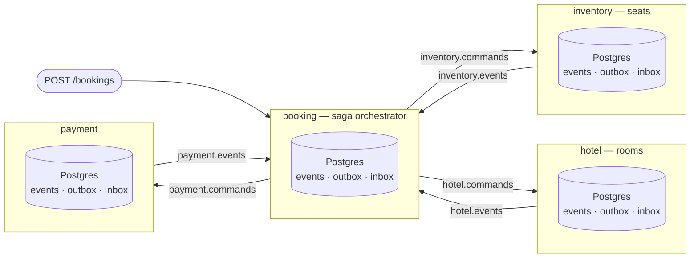
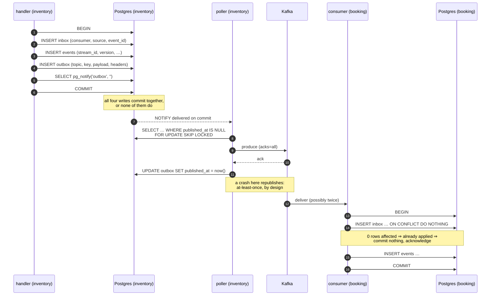
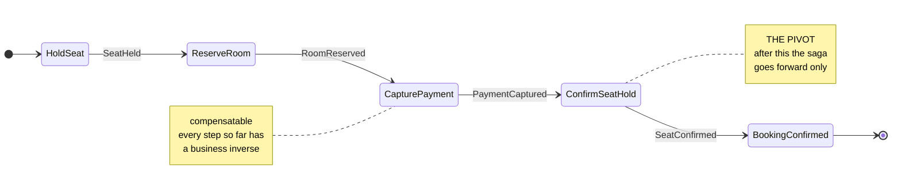
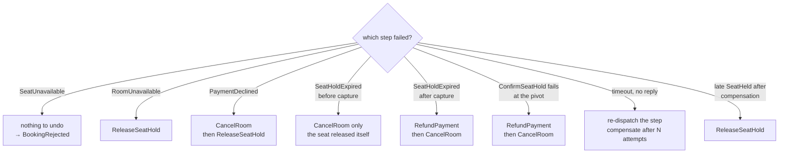

# Legibility L2 — Architecture and the Message Lifecycle

> **For agentic workers:** REQUIRED SUB-SKILL: Use superpowers:subagent-driven-development (recommended) or superpowers:executing-plans to implement this plan task-by-task. Steps use checkbox (`- [ ]`) syntax for tracking.

**Goal:** Give the reader the whole picture and one message traced end to end,
so that the per-package chapters in L3–L5 have somewhere to sit.

**Architecture:** Two cross-cutting documents, no code. `docs/architecture.md`
holds the four diagrams and the shape of the system — everything true of more
than one package. `docs/message-lifecycle.md` traces a single command from a
transaction in one service to applied effects in another, naming the actual
table columns, the actual Kafka headers and the actual bytes at every step.
Both are `docs/` content by the routing rule in `docs/conventions.md`: they
span packages, so no `doc.go` could hold them.

**Tech Stack:** Markdown. Mermaid for diagrams, rendered natively by GitHub.

**Spec:** [docs/superpowers/specs/2026-08-18-legibility-design.md](../specs/2026-08-18-legibility-design.md)
§10 (diagrams) and §11 (the worked example). Where this plan and the spec
disagree, the spec wins.

---

## Global Constraints

- **The standard is `docs/conventions.md`.** It is now written and committed;
  it is the authority for how these documents read. In particular: the reader
  is a competent Go programmer who has never seen this repository and has not
  read the design spec; nothing is explained in two places; `docs/` holds
  cross-cutting content only.
- **Honesty at the point of description (rule H2).** Diagrams 3 and 4 describe
  the saga and compensation, which do not exist — phases 7 and 10. Each must
  say so where it appears, not only in the README's status table.
- **No code changes.** No `.go` file is created or modified. The Go suite is run
  only to prove that.
- **Every value in `docs/message-lifecycle.md` must be real** — a column that
  exists in a migration, a header the envelope actually emits, a constant that
  is actually declared. A plausible-looking invented value is a defect, because
  the whole purpose of the document is that it can be checked against the code.
- **Every relative link must resolve**, including the two markers L1 left in
  `README.md` which this plan converts into links.
- Module path is `github.com/AymanKastali/sagaflow`.

---

## Scope

| In this plan | |
|---|---|
| `docs/architecture.md` | The four diagrams and the system's shape — legibility spec §10 |
| `docs/message-lifecycle.md` | One message traced with real values — legibility spec §11 |
| `README.md` | Two edits: convert the "not yet written" markers in reading-order steps 2 and 6 into links |

| Deferred | Where |
|---|---|
| Per-package `doc.go` chapters | L3 (`eventstore`, `outbox`, `inbox`, `pg`), L4 (`envelope`, `codec`, `schema`, `kafka`), L5 (`inventory`, `contracts`, `testsupport`, `cmd`) |
| The comment and naming rewrite | L5 |
| `internal/docs/docs_test.go` | L6 |
| The full booking-with-compensation walkthrough test | Phase 10 — the saga does not exist, so it cannot be written |
| Go `Example` functions | L5, where the packages they document get their chapters |

---

## File structure

```
docs/
├── architecture.md        ← new. the shape: services, topics, databases,
│                            the delivery path, the saga, compensation.
│                            four Mermaid diagrams.
├── message-lifecycle.md   ← new. one message, every step, real values.
├── conventions.md            unchanged
├── glossary.md               unchanged
README.md                  ← modified: two markers become links
```

The two new documents divide by **scale**: `architecture.md` answers "what are
the pieces and how are they arranged", `message-lifecycle.md` answers "what
actually happens, concretely, to one message". Neither explains a mechanism in
depth — that is what the L3–L5 chapters do, and both documents link forward to
them.

---

## Task 1: The architecture document

**Files:**
- Create: `docs/architecture.md`

**Interfaces:**
- Consumes: `docs/glossary.md` and `docs/conventions.md` (both exist).
- Produces: the anchors `#topology`, `#the-delivery-path`, `#the-saga` and
  `#compensation`, which `README.md` and later chapters link to.

- [ ] **Step 1: Write `docs/architecture.md`**

The document has five sections in this order: an opening statement of the
problem the architecture solves, then the four diagrams with their prose. Use
this content exactly.

````markdown
# Architecture

Four services take part in one booking: a flight seat, a hotel room, a payment.
They have **four separate databases** and no way to share a transaction. That is
the entire problem, and it is deliberate — one shared database would make the
problem disappear along with the lesson.

Everything here follows from a single constraint:

> A service can commit to its own database atomically. It cannot commit to its
> database and to Kafka atomically, and it cannot commit to another service's
> database at all.

Consistency is therefore not enforced. It is *arranged*, by making every
crossing point recoverable: a change and the message announcing it commit
together, a message that arrives twice is applied once, and a business step that
cannot be undone is never taken until everything that can be undone has
succeeded.

New here? Read the [README](../README.md) first, and keep the
[glossary](glossary.md) open.

---

## Topology



*Today only `inventory` is a working service. `booking` has its database
migrations and nothing else; `hotel` and `payment` do not exist. See the
[README's status table](../README.md#status).*

Each service owns a pair of topics — commands in, events out — and nothing else
reads its database.

| Topic | Produced by | Key | Consumed by |
|---|---|---|---|
| `inventory.commands` | `booking` | seat stream id | `inventory` |
| `inventory.events` | `inventory` | seat stream id | saga, projections |
| `hotel.commands` / `.events` | saga / `hotel` | room stream id | `hotel` / saga, projections |
| `payment.commands` / `.events` | saga / `payment` | payment stream id | `payment` / saga, projections |
| `booking.events` | `booking` | booking stream id | projections |
| `*.dlq` | any | original key | replay tooling |

**The key is always the target stream id.** That gives per-stream ordering, and
per-stream ordering is the only ordering guarantee anything in this system
relies on. Two events about the same seat arrive in order; two events about
different seats have no defined order and nothing may assume one.

Consumer groups are named per *purpose*, not per service — `booking.saga`,
`booking.projection`, `inventory.commands` — because one service consumes the
same topic more than once for different reasons. That is why the consumer name
is part of the inbox primary key.

Every service's database holds the same three tables plus its own domain
projections:

| Table | Holds |
|---|---|
| `events` | the append-only log. `UNIQUE (stream_id, version)` |
| `outbox` | messages waiting to be published, written in the transaction that produced them |
| `inbox` | which messages this service has already applied |

---

## The delivery path

This is the sequence that makes "the state changed" and "the world was told"
survive a crash at any point. It is the heart of the system.



Three things about this diagram are worth stating plainly.

**The `NOTIFY` is transactional.** Postgres delivers it on commit and discards it
on rollback, so a woken poller can never chase a row that was never written.
This is why the wake-up needs no separate reliability story of its own.

**The gap between produce and mark is not closable.** The poller can publish a
row and die before recording that it did, and will publish it again on restart.
Every design that removes this window puts a worse one somewhere else —
mark-then-publish loses messages outright. So the duplicate is accepted, and
corrected at the consumer.

**The correction is the inbox insert, and it is inside the consumer's
transaction.** If the insert reports zero rows affected, this message has been
applied before: the handler commits nothing and acknowledges. Because the mark
and the effects share one transaction, they cannot come apart — which is what
turns at-least-once delivery into applied-exactly-once.

Where the code lives: `internal/platform/outbox` (enqueue and poller),
`internal/platform/inbox` (deduplication), `internal/platform/kafka` (produce
and consume), `internal/platform/eventstore` (the log). Each has its own chapter
— run `go doc ./internal/platform/outbox` and so on.

---

## The saga

*Not built. This section describes the design from the spec; phase 7 implements
it. Nothing in `internal/` corresponds to it yet.*

A booking is a business transaction spanning services that cannot share a
database transaction. SagaFlow **orchestrates** it: one service, `booking`,
holds the sequence and dispatches each step, rather than each service reacting
to the previous one's events. The orchestrator is itself event-sourced on a
`saga-{id}` stream, so crash recovery is replay and nothing else.



`HoldSeat`, `ReserveRoom` and `CapturePayment` are **compensatable** — each has
a business inverse. `ConfirmSeatHold` is the **pivot**: once a hold becomes a
confirmed seat there is no inverse, so everything after it is **retriable** and
must eventually succeed.

The saga's own decision function is pure — no database, no Kafka, no context:

```go
func (s SagaState) Decide(e Event) []Command
```

That is what makes every path through the compensation matrix testable without
infrastructure.

---

## Compensation

*Not built. Phase 7 implements the matrix; phase 10 tests every path through
it.*

When a step fails, the completed steps are undone in reverse order.



Three properties follow, and they are the substance of the design.

**Compensation is not rollback.** A refund is a new fact, recorded forever, not
an erasure of the payment. Cancelling a *confirmed* booking looks identical from
the outside — refund, cancel room, release seat — but is a separate business
flow with its own saga and its own policy, because "this transaction failed" and
"the customer changed their mind" need different audit trails.

**Compensations never dead-letter.** A failed `RefundPayment` means real money is
stranded and real inventory is held. It retries with backoff indefinitely and
raises an alert. The dead-letter policy applies to forward steps only.

**Late replies are absorbed, not errors.** A `SeatHeld` arriving after the saga
has already compensated finds a state where that step was abandoned, so the
decision function returns `ReleaseSeatHold` instead of proceeding.

---

## Where to go next

- [The message lifecycle](message-lifecycle.md) — this delivery path traced
  concretely, with the actual rows, headers and bytes.
- `go doc ./internal/platform/eventstore` — how state is stored.
- The [design spec](superpowers/specs/2026-08-17-sagaflow-design.md) — every
  decision, including the ones that were rejected and why.
````

- [ ] **Step 2: Verify the Mermaid blocks are balanced and correctly fenced**

A diagram that does not parse renders as a wall of error text, which is worse
than no diagram.

```bash
echo "fences: $(grep -c '^```mermaid$' docs/architecture.md)"
awk '/^```mermaid$/{f=1;next} /^```$/{f=0} f' docs/architecture.md \
  | grep -c '^\s*subgraph' | xargs echo "subgraph:"
awk '/^```mermaid$/{f=1;next} /^```$/{f=0} f' docs/architecture.md \
  | grep -c '^\s*end$' | xargs echo "end:"
awk 'BEGIN{n=0} /^```/{n++} END{print "total fences (must be even):", n}' docs/architecture.md
```

Expected: `fences: 4`; `subgraph:` and `end:` both `4` (the four subgraphs of
the topology diagram); total fences even.

The state diagram's two `note` blocks close with `end note`, not a bare `end`,
so they do not appear in either count — the two numbers are directly comparable.
If they disagree, the topology diagram is broken.

- [ ] **Step 3: Verify every claim about topics and tables against the code**

The document asserts specific column names and topic names. Each must exist.

```bash
grep -q 'CommandsTopic = "inventory.commands"' internal/inventory/commands.go || echo "WRONG: inventory.commands"
grep -q 'EventsTopic   = "inventory.events"' internal/inventory/commands.go || echo "WRONG: inventory.events"
for col in stream_id version type data meta recorded_at; do
  grep -q "$col" internal/inventory/migrations/001_events.sql || echo "WRONG events column: $col"
done
for col in topic key payload headers published_at; do
  grep -q "$col" internal/inventory/migrations/002_outbox.sql || echo "WRONG outbox column: $col"
done
for col in consumer source event_id handled_at; do
  grep -q "$col" internal/inventory/migrations/003_inbox.sql || echo "WRONG inbox column: $col"
done
grep -q 'FOR UPDATE SKIP LOCKED' internal/platform/outbox/poller.go || echo "WRONG: SKIP LOCKED claim"
grep -q "pg_notify" internal/platform/outbox/outbox.go || echo "WRONG: pg_notify"
grep -q 'ON CONFLICT (consumer, source, event_id) DO NOTHING' internal/platform/inbox/inbox.go || echo "WRONG: inbox ON CONFLICT"
echo "claim check done"
```

Expected: no `WRONG` lines, then `claim check done`.

- [ ] **Step 4: Verify the unbuilt sections are marked (rule H2)**

```bash
for h in '## The saga' '## Compensation'; do
  awk -v t="$h" '$0==t{f=1;next} /^## /{f=0} f' docs/architecture.md \
    | head -4 | grep -q 'Not built' || echo "UNMARKED: $h"
done
awk '/^## Topology/{f=1;next} /^## /{f=0} f' docs/architecture.md \
  | grep -q 'only .inventory. is a working service' || echo "UNMARKED: Topology"
echo "H2 check done"
```

Expected: no `UNMARKED` lines, then `H2 check done`.

- [ ] **Step 5: Verify links resolve**

```bash
grep -oP '\]\(\K[^)]+' docs/architecture.md | grep -v '^http' | sed 's/#.*//' | grep -v '^$' \
  | while read -r t; do [ -e "docs/$t" ] || echo "BROKEN: $t"; done
echo "link check done"
```

Expected: `BROKEN: message-lifecycle.md` (written in Task 2) and nothing else,
then `link check done`.

- [ ] **Step 6: Commit**

```bash
git add docs/architecture.md
git commit -m "docs: the architecture — four diagrams and the shape of the system

Everything follows from one constraint stated up front: a service can commit
to its own database atomically, cannot commit to its database and Kafka
atomically, and cannot commit to another service's database at all.
Consistency is not enforced here, it is arranged.

The delivery-path sequence diagram is the one that matters — it shows the
four writes that must commit together, the NOTIFY that Postgres delivers only
on commit, the produce-then-mark gap that cannot be closed, and the inbox
insert inside the consumer's transaction that corrects for it.

The saga and compensation sections describe behavior that does not exist and
say so at the point of description, per rule H2.

Co-Authored-By: Claude Opus 5 (1M context) <noreply@anthropic.com>"
```

---

## Task 2: The message lifecycle

**Files:**
- Create: `docs/message-lifecycle.md`

**Interfaces:**
- Consumes: `docs/architecture.md` from Task 1 (linked as the abstract version
  of the same path).
- Produces: nothing later depends on.

**The rule that governs this document:** every value shown must be traceable to
code. Not "a UUID" but the fact that `envelope.NewID` returns a UUIDv7. Not "a
header" but `ce_type` carrying the fully qualified protobuf message name. A
reader must be able to check any line of it.

- [ ] **Step 1: Write `docs/message-lifecycle.md`**

````markdown
# The life of one message

The [architecture](architecture.md) describes the delivery path in the
abstract. This traces one message through it concretely: a `HoldSeat` command
arriving at `inventory`, and the `SeatHeld` event that leaves.

Every value below is real — a column that exists in a migration, a header the
code actually emits, a constant that is actually declared. Each step names the
file it comes from, so you can check any line of this against the code.

---

## Before it arrives

The command was produced by another service's transaction, so it reached Kafka
by exactly the path the second half of this document describes. Skip ahead and
come back if you want that end first.

It arrives as a Kafka record on topic `inventory.commands`, keyed by the seat
stream id.

**The key matters more than it looks.** Kafka guarantees ordering only within a
partition, and the key is what chooses the partition. Keying by stream id means
every message about `seat-BA117-2026-09-01-14A` lands in one partition and is
therefore ordered. Messages about different seats have no defined order, and
nothing in the system may assume one.

**Headers** — CloudEvents v1.0.2, binary content mode, so the attributes are
headers and the body is the payload alone (`internal/platform/envelope`):

| Header | Value | Notes |
|---|---|---|
| `ce_specversion` | `1.0` | the only version this system speaks |
| `ce_id` | a UUIDv7 | `envelope.NewID()`. Unique with `ce_source` by the CloudEvents spec — which is exactly what deduplication needs, so the pair is the inbox key rather than something we invent |
| `ce_source` | `/sagaflow/booking` | who emitted it |
| `ce_type` | `sagaflow.inventory.v1.HoldSeat` | the fully qualified protobuf message name |
| `ce_subject` | `seat-BA117-2026-09-01-14A` | the stream id |
| `ce_correlationid` | the saga id | everything belonging to this one booking shares it |
| `ce_causationid` | the `ce_id` of the message that caused this one | the parent link |
| `content-type` | `application/protobuf` | |

Optional attributes are **omitted entirely rather than written empty**: an absent
`ce_subject` is a different statement from an empty one.

**The body** is Confluent-framed protobuf (`internal/platform/schema`):

```
byte 0      0x00                     magic byte
bytes 1-4   big-endian int32         the registered schema id
byte 5      0x00                     message-index path [0], shortened
bytes 6+    protobuf                 the HoldSeat message itself
```

Byte 5 is the message-index path — which message inside the `.proto` file this
is. Every `.proto` file in this repository holds exactly one message, so the path
is always `[0]`, which the format shortens to a single zero byte. That is not a
style preference: a second message in a file would be framed under the wrong
index and be unreadable by any other Confluent client, while still round-tripping
perfectly through our own code.

---

## Applied, in one transaction

The handler is `internal/inventory/commands.go`. Everything below happens inside
a single database transaction that either commits all of it or none of it.

### 1. Is this the first time we have seen it?

```sql
INSERT INTO inbox (consumer, source, event_id)
VALUES ('inventory.commands', '/sagaflow/booking', '<ce_id>')
ON CONFLICT (consumer, source, event_id) DO NOTHING
```

Rows affected is the answer. **One** means this is the first delivery, so carry
on. **Zero** means this exact message has been applied before: the handler
commits nothing and acknowledges, and the duplicate is absorbed.

The primary key is `(consumer, source, event_id)`
(`internal/inventory/migrations/003_inbox.sql`). `consumer` is in the key
because several consumers inside one service read the same message for different
purposes and must each deduplicate independently.

**This insert is inside the transaction, not before it.** That placement is
load-bearing twice over: it is what makes the mark and the effects inseparable,
and it is what lets a failed attempt be retried — a rolled-back transaction
takes the mark with it, so the retry sees an unconsumed message rather than its
own footprint.

### 2. Load the seat's history and fold it

```sql
SELECT version, type, data FROM events WHERE stream_id = $1 ORDER BY version
```

The rows are decoded to protobuf messages and replayed in order to compute the
seat's current state (`internal/inventory/seat.go`). The state is small: a
version, a status, the live hold's id, its booking id and its expiry.

**A seat is a stream.** That single decision is why "this seat is held at most
once" needs no lock: the constraint is `UNIQUE (stream_id, version)`
(`internal/inventory/migrations/001_events.sql`) and nothing else. A stream per
flight would have serialised every seat in the aircraft. A stream per booking
would have left the constraint unable to see the conflict at all.

### 3. Decide

```go
func Decide(s SeatState, cmd proto.Message) (Outcome, error)
```

Pure — no context, no database, and deliberately no clock. It returns an
`Outcome` with two lists:

| | Goes to | Because |
|---|---|---|
| `Events` | the seat's stream **and** the outbox | something happened to the seat |
| `Replies` | the outbox only | the caller must hear an answer, but nothing happened |

For a free seat, `HoldSeat` produces one event, `SeatHeld`. For a seat already
held by someone else it produces one reply, `SeatUnavailable` — which is
deliberately *not* appended, because nothing happened to the seat and appending
it would grow the seat's history by one row for every losing racer.

**Every command gets a reply; only a change gets an event.** Nothing may produce
silence, because a saga step that hears nothing re-dispatches forever.

There is no clock in this function because expiry is an event, appended by
inventory's own timer, not a comparison against `now()`. That is what stops a new
hold racing an expiry: the stream is the only truth about whether a hold is live.

### 4. Append the events

```sql
INSERT INTO events (stream_id, version, type, data, meta) VALUES …
```

`version` is the folded version plus one. If another transaction got there
first, `UNIQUE (stream_id, version)` rejects this insert and the handler gets a
version conflict.

**A conflict is expected, not exceptional.** The loser reloads the stream and
decides again — three times, then it fails
(`ConflictRetries = 3` in `internal/inventory/commands.go`). Re-deciding is the
whole point: replaying the old decision would append a second hold, whereas
deciding again against the state that now exists turns it into a refusal.

`data` is JSONB, not the protobuf bytes. **One schema, two encodings**: protojson
in Postgres so the log is greppable and inspectable by hand, binary protobuf on
the wire so it is compact. Both come from the same `.proto` file, so they cannot
drift (`internal/platform/codec`).

### 5. Enqueue the outgoing messages

```sql
INSERT INTO outbox (topic, key, payload, headers) VALUES …
SELECT pg_notify('outbox', '')
```

Each outgoing message gets a fresh `ce_id`, the incoming `ce_correlationid`
unchanged, and the incoming `ce_id` as its `ce_causationid`. The key is the seat
stream id again, so the reply is ordered with everything else about that seat.

The `NOTIFY` is transactional: Postgres delivers it on commit and discards it on
rollback, so the poller can never be woken for a row that was never written.

### 6. Commit

Four writes — the inbox mark, the events, the outbox rows, the notification —
commit together or not at all. That is the one invariant every handler in this
system obeys, and it is the reason nothing has to reconcile anything afterwards.

---

## Published, afterwards

The poller (`internal/platform/outbox/poller.go`) runs separately, woken by the
`NOTIFY` or by its own timer.

```sql
SELECT id, topic, key, payload, headers
FROM outbox
WHERE published_at IS NULL
ORDER BY id
LIMIT $1
FOR UPDATE SKIP LOCKED
```

**Rows are claimed by flag, never by a cursor over `id`.** `BIGSERIAL` values are
handed out at insert but become visible at commit, so a row that commits late can
carry a lower id than one already published. A cursor would step over it and lose
it silently — and only ever under concurrency, which is the worst kind of bug to
own. A flag has no such window: whatever is still `NULL` is claimed on the next
pass.

`SKIP LOCKED` is for failover, not throughput: a second poller taking over
mid-batch makes progress instead of blocking behind the first one's rows.

The rows are produced to Kafka with `acks=all`, and only then:

```sql
UPDATE outbox SET published_at = now() WHERE id = ANY($1)
```

**A crash between the produce and this update republishes the message.** That
window cannot be closed — marking first would lose messages outright when the
produce fails. So it is accepted, and corrected at the far end by step 1 of this
document, running in the consumer.

That is the whole loop: at-least-once out, applied-exactly-once in.

---

## Checking any of this

Every claim above is in code you can read:

| Claim | File |
|---|---|
| CloudEvents header names and the omit-empty rule | `internal/platform/envelope/envelope.go` |
| Confluent framing and the `[0]` message index | `internal/platform/schema/serde.go` |
| protojson in Postgres, protobuf on the wire | `internal/platform/codec/codec.go` |
| `UNIQUE (stream_id, version)` | `internal/inventory/migrations/001_events.sql` |
| The inbox primary key and its comment | `internal/inventory/migrations/003_inbox.sql` |
| The one-transaction handler and `ConflictRetries` | `internal/inventory/commands.go` |
| Claim-by-flag, `SKIP LOCKED`, and why not a cursor | `internal/platform/outbox/poller.go` |
| The transactional `NOTIFY` | `internal/platform/outbox/outbox.go` |

And the tests that prove it end to end are in `internal/integration/`:
`TestEventCrossesServicesExactlyOnce` and `TestRebalanceMidHandlerLosesNothing`.
````

- [ ] **Step 2: Verify every file the document names actually exists**

The document's whole value is that it can be checked, so a reference to a file
that does not exist is the worst possible defect in it.

```bash
grep -oP '`\Kinternal/[a-z0-9_/]+\.(go|sql)(?=`)' docs/message-lifecycle.md | sort -u \
  | while read -r f; do [ -f "$f" ] || echo "MISSING FILE: $f"; done
echo "file reference check done"
```

Expected: no `MISSING FILE` lines, then `file reference check done`.

- [ ] **Step 3: Verify the named symbols and tests exist**

```bash
grep -q 'func NewID' internal/platform/envelope/envelope.go || echo "MISSING: envelope.NewID"
grep -q 'ConflictRetries = 3' internal/inventory/commands.go || echo "MISSING: ConflictRetries = 3"
grep -q 'func Decide' internal/inventory/seat.go || echo "MISSING: Decide"
grep -q 'TestEventCrossesServicesExactlyOnce' internal/integration/delivery_test.go || echo "MISSING: exactly-once test"
grep -q 'TestRebalanceMidHandlerLosesNothing' internal/integration/delivery_test.go || echo "MISSING: rebalance test"
grep -q 'SpecVersion = "1.0"' internal/platform/envelope/envelope.go || echo "MISSING: specversion 1.0"
grep -q 'ContentType = "application/protobuf"' internal/platform/envelope/envelope.go || echo "MISSING: content type"
echo "symbol check done"
```

Expected: no `MISSING` lines, then `symbol check done`.

- [ ] **Step 4: Verify links resolve**

```bash
grep -oP '\]\(\K[^)]+' docs/message-lifecycle.md | grep -v '^http' | sed 's/#.*//' | grep -v '^$' \
  | while read -r t; do [ -e "docs/$t" ] || echo "BROKEN: $t"; done
echo "link check done"
```

Expected: no `BROKEN` lines, then `link check done`.

- [ ] **Step 5: Commit**

```bash
git add docs/message-lifecycle.md
git commit -m "docs: trace one message end to end with real values

The architecture document describes the delivery path abstractly. This walks
a HoldSeat command through it concretely: the Kafka key and why it is the
stream id, every CloudEvents header, the six framing bytes, the four writes
inside the handler's transaction, and the poller's claim-by-flag afterwards.

Every value is traceable to code, and the closing table says which file each
claim lives in, so a reader can check any line of it. That constraint is the
document's whole point — an invented but plausible value would make it
useless.

Co-Authored-By: Claude Opus 5 (1M context) <noreply@anthropic.com>"
```

---

## Task 3: Wire the README's reading order

**Files:**
- Modify: `README.md` — reading-order steps 2 and 6

**Interfaces:**
- Consumes: `docs/architecture.md` (Task 1) and `docs/message-lifecycle.md`
  (Task 2), both of which now exist.
- Produces: a README with no unresolved forward references.

L1 wrote two reading-order entries that named documents not yet written and said
so in plain text rather than linking to files that did not exist. Both now exist.

- [ ] **Step 1: Replace step 2**

Find this text in `README.md`:

```markdown
2. **The architecture walkthrough** — the whole picture, with diagrams.
   *Not yet written; it arrives in the next documentation pass.*
```

Replace with:

```markdown
2. **[The architecture](docs/architecture.md)** — the whole picture, with
   diagrams: the topology, the delivery path that makes crashes survivable, the
   saga, and the compensation matrix.
```

- [ ] **Step 2: Replace step 6**

Find this text in `README.md`:

```markdown
6. **The message lifecycle** — the three above traced end to end with the
   actual rows and headers. *Not yet written; it arrives in the next
   documentation pass.*
```

Replace with:

```markdown
6. **[The message lifecycle](docs/message-lifecycle.md)** — the three above
   traced end to end with the actual rows, headers and bytes.
```

- [ ] **Step 3: Verify no "not yet written" markers remain in the reading order**

```bash
awk '/^## Reading order/{f=1;next} /^---$/{if(f)exit} f' README.md \
  | grep -n 'Not yet written' && echo "MARKER REMAINS" || echo "no markers remain"
```

Expected: `no markers remain`.

- [ ] **Step 4: Verify every link in all five documents resolves**

This is the whole documentation set now. Nothing may be broken.

```bash
for f in README.md docs/architecture.md docs/message-lifecycle.md \
         docs/conventions.md docs/glossary.md; do
  d=$(dirname "$f")
  grep -oP '\]\(\K[^)]+' "$f" | grep -v '^http' | sed 's/#.*//' | grep -v '^$' \
    | while read -r t; do [ -e "$d/$t" ] || echo "BROKEN in $f: $t"; done
done
echo "link check done"
```

Expected: no `BROKEN` lines, then `link check done`.

- [ ] **Step 5: Verify no Go file changed, and the suite is green**

```bash
git diff --stat $(git merge-base main HEAD)..HEAD -- '*.go' && echo "(empty above = no Go changed by this branch)"
make lint && make test 2>&1 | tail -3
```

Expected: an empty diff for this branch's own range, `make lint` clean and
`make test` green.

- [ ] **Step 6: Commit**

```bash
git add README.md
git commit -m "docs: link the reading order to the documents it names

L1 left steps 2 and 6 naming documents that did not exist yet, saying so in
plain text rather than linking to files that were not there. Both now exist,
so the markers become links and the README has no unresolved forward
references.

Co-Authored-By: Claude Opus 5 (1M context) <noreply@anthropic.com>"
```

---

## Done when

- [ ] `docs/architecture.md` and `docs/message-lifecycle.md` exist
- [ ] Four Mermaid diagrams, all fenced correctly and balanced
- [ ] The saga and compensation sections are marked as unbuilt at the point of
      description, and so is the topology diagram (rule H2)
- [ ] Every column, topic, constant and file the two documents name is verified
      to exist in the code
- [ ] `README.md` reading-order steps 2 and 6 are links, and no "not yet
      written" marker remains in the reading order
- [ ] Every relative link across all five documents resolves
- [ ] No `.go` file changed by this branch
- [ ] `make lint` clean, `make test` green
- [ ] Three commits, one per task

## Deliberately not done here

- **Per-package `doc.go` chapters** — L3, L4, L5. Both documents in this plan
  link forward to them with `go doc` invocations, which is why they can stay
  shallow on mechanism.
- **The comment and naming rewrite** — L5.
- **`internal/docs/docs_test.go`** — L6.
- **The full booking-with-compensation walkthrough test** — phase 10. The saga
  does not exist, so the only honest thing this plan can do is describe it and
  say it is not built.
